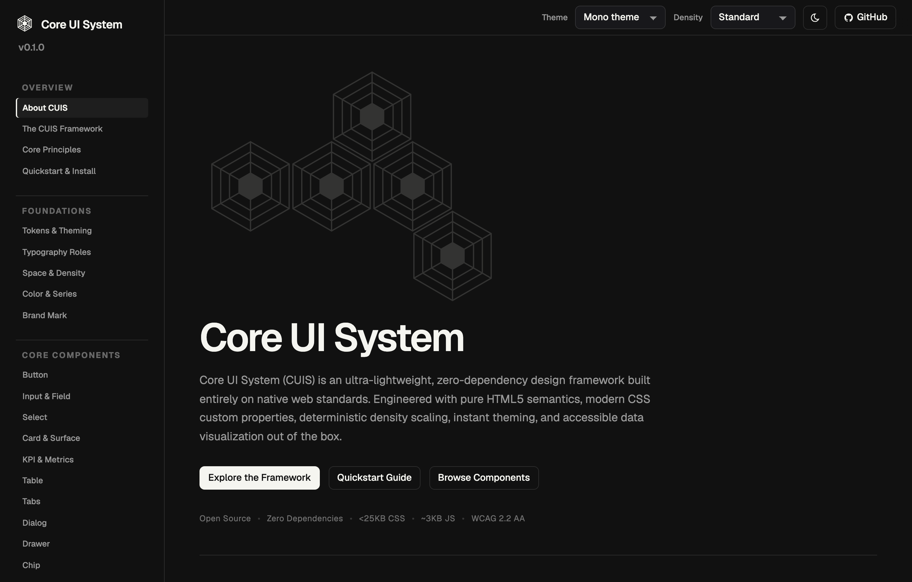
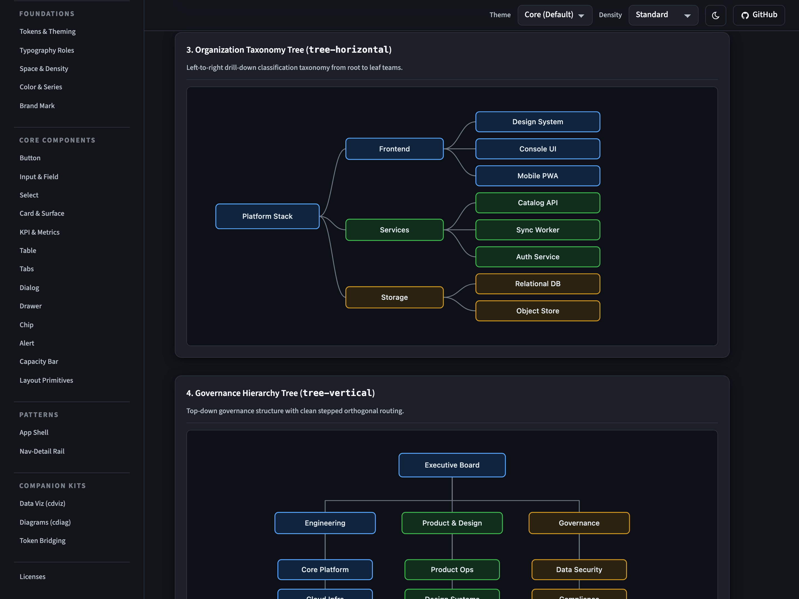

<p align="center">
  <br>
  <br>
  <picture>
    <source media="(prefers-color-scheme: dark)" srcset="mark-on-dark.svg">
    
  </picture>
</p>
<h3 align="center">Core UI System</h3>

<p align="center">
  An open source, zero-dependency design system with chart and diagramming suite.
  <br>
  <a href="https://robchappell.github.io/CUIS"><strong>Explore the docs »</strong></a>
  <br>
  <br>
  <a href="#quickstart">Quickstart</a>
  ·
  <a href="CONTRIBUTING.md">Contributing</a>
  ·
  <a href="SECURITY.md">Security</a>
  <br>
</p>

<br>
<hr>
<br>

<p align="center">
  
</p>

<br>
<hr>
<br>

<p align="center">
  
</p>

<br>
<hr>
<br>

## Quickstart

```html
<!DOCTYPE html>
<html lang="en" data-cuis-theme="core" data-cuis-appearance="light" data-cuis-density="standard">
<head>
  <meta charset="utf-8">
  <meta name="viewport" content="width=device-width, initial-scale=1">
  <title>My Application</title>
  <link rel="stylesheet" href="packages/core/themes/core.css">
  <link rel="stylesheet" href="packages/core/cuis.css">
  <script src="packages/core/cuis.js" defer></script>
</head>
<body>
  <h1 class="cuis-page-title">My Application</h1>
</body>
</html>
```

`data-cuis-theme` is `core`, `mono`, or `redhat`. `data-cuis-appearance` is `light` or `dark`. `data-cuis-density` is `compact`, `standard`, or `comfortable`.

Open `index.html` in this repository for the full specimen.

## Charts and diagrams

Add these when a page needs charts or diagrams:

```html
<link rel="stylesheet" href="packages/viz/cdviz.css">
<link rel="stylesheet" href="packages/diag/cdiag.css">
<link rel="stylesheet" href="packages/bridge/kits.css">
<script src="packages/viz/cdviz.js" defer></script>
<script src="packages/diag/cdiag.js" defer></script>
```

Set `data-theme` on `<html>` to the same value as `data-cuis-appearance`: `light` or `dark`.

## Themes

`core` is the default. `mono` is a grayscale theme that uses Geist. `redhat` is inspired by Red Hat and uses the open-source Red Hat fonts. That theme is not a Red Hat product.

Themes load fonts from Google Fonts. See [SECURITY.md](SECURITY.md) if a deployment cannot make that request.

## License

Code, docs, charts, diagrams, and the bridge are under the [MIT license](LICENSE). Fonts are not included. See [NOTICE](NOTICE), [SECURITY.md](SECURITY.md), and [CONTRIBUTING.md](CONTRIBUTING.md).

Folder names such as `packages/core` are the source layout. They are not npm package names.
